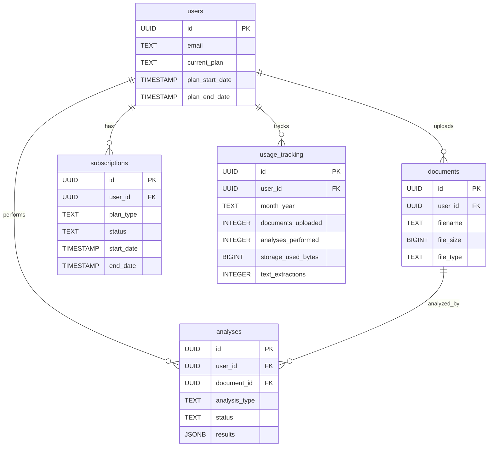

# 🗄️ Database Schema Documentation

## 📋 Overview
This document outlines the complete database schema for the legaltech application, including the newly implemented subscription system.

---

## 🏗️ **CORE TABLES**

### 👥 **users**
**Purpose:** Store user account information and authentication details

```sql
CREATE TABLE users (
    id UUID PRIMARY KEY DEFAULT gen_random_uuid(),
    email TEXT UNIQUE NOT NULL,
    created_at TIMESTAMP WITH TIME ZONE DEFAULT NOW(),
    updated_at TIMESTAMP WITH TIME ZONE DEFAULT NOW(),
    
    -- Subscription fields (NEW)
    current_plan TEXT DEFAULT 'free' CHECK (current_plan IN ('free', 'plus', 'max')),
    plan_start_date TIMESTAMP WITH TIME ZONE DEFAULT NOW(),
    plan_end_date TIMESTAMP WITH TIME ZONE
);
```

**Indexes:**
- `idx_users_email` on `email`
- `idx_users_current_plan` on `current_plan`

---

### 📄 **documents**
**Purpose:** Store uploaded legal documents and metadata

```sql
CREATE TABLE documents (
    id UUID PRIMARY KEY DEFAULT gen_random_uuid(),
    user_id UUID NOT NULL REFERENCES auth.users(id) ON DELETE CASCADE,
    filename TEXT NOT NULL,
    original_filename TEXT NOT NULL,
    file_size BIGINT NOT NULL,
    file_type TEXT NOT NULL,
    storage_path TEXT,
    upload_status TEXT DEFAULT 'pending',
    document_type TEXT,
    created_at TIMESTAMP WITH TIME ZONE DEFAULT NOW(),
    updated_at TIMESTAMP WITH TIME ZONE DEFAULT NOW()
);
```

**Indexes:**
- `idx_documents_user_id` on `user_id`
- `idx_documents_upload_status` on `upload_status`
- `idx_documents_created_at` on `created_at`

---

### 🧠 **analyses**
**Purpose:** Store AI analysis results and metadata

```sql
CREATE TABLE analyses (
    id UUID PRIMARY KEY DEFAULT gen_random_uuid(),
    user_id UUID NOT NULL REFERENCES auth.users(id) ON DELETE CASCADE,
    document_id UUID REFERENCES documents(id) ON DELETE SET NULL,
    analysis_type TEXT NOT NULL,
    status TEXT DEFAULT 'pending',
    results JSONB,
    created_at TIMESTAMP WITH TIME ZONE DEFAULT NOW(),
    updated_at TIMESTAMP WITH TIME ZONE DEFAULT NOW(),
    completed_at TIMESTAMP WITH TIME ZONE
);
```

**Indexes:**
- `idx_analyses_user_id` on `user_id`
- `idx_analyses_document_id` on `document_id`
- `idx_analyses_status` on `status`
- `idx_analyses_created_at` on `created_at`

---

## 💰 **SUBSCRIPTION SYSTEM TABLES (NEW)**

### 🔐 **subscriptions**
**Purpose:** Manage user subscription plans and billing

```sql
CREATE TABLE subscriptions (
    id UUID PRIMARY KEY DEFAULT gen_random_uuid(),
    user_id UUID NOT NULL REFERENCES auth.users(id) ON DELETE CASCADE,
    plan_type TEXT NOT NULL CHECK (plan_type IN ('free', 'plus', 'max')),
    status TEXT NOT NULL DEFAULT 'active' CHECK (status IN ('active', 'cancelled', 'expired')),
    start_date TIMESTAMP WITH TIME ZONE NOT NULL DEFAULT NOW(),
    end_date TIMESTAMP WITH TIME ZONE,
    stripe_subscription_id TEXT,
    created_at TIMESTAMP WITH TIME ZONE DEFAULT NOW(),
    updated_at TIMESTAMP WITH TIME ZONE DEFAULT NOW(),
    
    -- Ensure one active subscription per user
    UNIQUE(user_id, status) WHERE status = 'active'
);
```

**Indexes:**
- `idx_subscriptions_user_id` on `user_id`
- `idx_subscriptions_status` on `status`
- `idx_subscriptions_plan_type` on `plan_type`

---

### 📊 **usage_tracking**
**Purpose:** Track monthly usage for subscription enforcement

```sql
CREATE TABLE usage_tracking (
    id UUID PRIMARY KEY DEFAULT gen_random_uuid(),
    user_id UUID NOT NULL REFERENCES auth.users(id) ON DELETE CASCADE,
    month_year TEXT NOT NULL, -- Format: YYYY-MM
    documents_uploaded INTEGER NOT NULL DEFAULT 0,
    analyses_performed INTEGER NOT NULL DEFAULT 0,
    storage_used_bytes BIGINT NOT NULL DEFAULT 0,
    text_extractions INTEGER NOT NULL DEFAULT 0,
    created_at TIMESTAMP WITH TIME ZONE DEFAULT NOW(),
    updated_at TIMESTAMP WITH TIME ZONE DEFAULT NOW(),
    
    -- Ensure one record per user per month
    UNIQUE(user_id, month_year)
);
```

**Indexes:**
- `idx_usage_tracking_user_id` on `user_id`
- `idx_usage_tracking_month_year` on `month_year`

---

## 🔗 **RELATIONSHIPS**



---

## 📊 **PLAN LIMITS & USAGE**

### 🆓 **Free Plan**
- **Documents:** 5 per month
- **Analyses:** 20 per month
- **Storage:** 100 MB
- **Text Extractions:** 5 per month
- **Enforcement:** Hard stop at 100%

### ⭐ **Plus Plan**
- **Documents:** 50 per month
- **Analyses:** 200 per month
- **Storage:** 2 GB
- **Text Extractions:** 50 per month
- **Enforcement:** Warning at 80%, soft stop at 100%

### 🚀 **Max Plan**
- **Documents:** Unlimited
- **Analyses:** Unlimited
- **Storage:** 50 GB
- **Text Extractions:** Unlimited
- **Enforcement:** Fair use policy

---

## 🔧 **HELPER FUNCTIONS**

### 📅 **get_current_month_usage(user_uuid UUID)**
Returns current month usage for a specific user.

### 📏 **get_plan_limits(plan TEXT)**
Returns usage limits for a specific plan type.

---

## 👀 **VIEWS**

### 📊 **user_subscription_status**
Provides a comprehensive view of user subscription and usage status.

```sql
CREATE VIEW user_subscription_status AS
SELECT 
    u.id as user_id,
    u.email,
    u.current_plan,
    u.plan_start_date,
    u.plan_end_date,
    s.status as subscription_status,
    s.stripe_subscription_id,
    TO_CHAR(NOW(), 'YYYY-MM') as current_month,
    COALESCE(ut.documents_uploaded, 0) as documents_uploaded,
    COALESCE(ut.analyses_performed, 0) as analyses_performed,
    COALESCE(ut.storage_used_bytes, 0) as storage_used_bytes,
    COALESCE(ut.text_extractions, 0) as text_extractions
FROM users u
LEFT JOIN subscriptions s ON u.id = s.user_id AND s.status = 'active'
LEFT JOIN usage_tracking ut ON u.id = ut.user_id AND ut.month_year = TO_CHAR(NOW(), 'YYYY-MM');
```

---

## 🔒 **SECURITY & RLS**

### 🛡️ **Row Level Security (RLS)**
All tables have RLS enabled with policies ensuring users can only access their own data.

### 🔑 **Permissions**
- **Authenticated users:** SELECT, INSERT, UPDATE on their own records
- **Public:** No access (all operations require authentication)

---

## 📈 **USAGE TRACKING FLOW**

1. **Document Upload:**
   - Check usage limits before upload
   - Increment `documents_uploaded` and `storage_used_bytes`
   - Block if limits exceeded

2. **AI Analysis:**
   - Check usage limits before analysis
   - Increment `analyses_performed`
   - Block if limits exceeded

3. **Text Extraction:**
   - Check usage limits before extraction
   - Increment `text_extractions`
   - Block if limits exceeded

4. **Monthly Reset:**
   - All usage counters reset on 1st of each month
   - New `usage_tracking` records created automatically

---

## 🚀 **DEPLOYMENT STATUS**

- ✅ **Core Tables:** Fully implemented
- ✅ **Subscription Tables:** Fully implemented
- ✅ **Usage Tracking:** Fully implemented
- ✅ **RLS Policies:** Fully implemented
- ✅ **Helper Functions:** Fully implemented
- ✅ **Views:** Fully implemented
- 🔄 **Stripe Integration:** In progress
- 🔄 **UI Updates:** In progress

---

*Last Updated: August 30, 2025*  
*Version: 2.0*  
*Status: Production Ready (Subscription System)*
